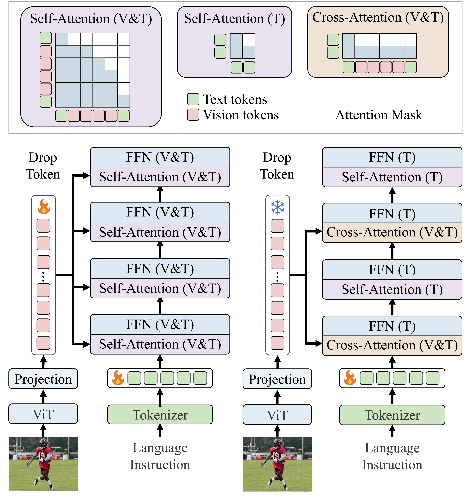

<h1 align="center">
<span>ViCA: Efficient Multimodal LLMs</span><br>
<span>with Vision-Only Cross-Attention</span>
</h1>

<div align="center">

[](https://arxiv.org/abs/2602.07574)
[](https://huggingface.co/HarrisonWu/ViCA)
[](https://opensource.org/licenses/Apache-2.0)
[](https://github.com/EIT-NLP/ViCA)


</div>

> <strong> ViCA: Efficient Multimodal LLMs with Vision-Only Cross-Attention </strong>
>
> <a href="https://github.com/FakeWoke" rel="nofollow">Wenjie Liu</a><sup>\*,1</sup>, 
<a href="https://scholar.google.com/citations?hl=zh-CN&user=Ix9RD18AAAAJ" rel="nofollow">Hao Wu</a><sup>\*,1</sup>, 
Xin Qiu<sup>1</sup>, 
<a href="https://scholar.google.com/citations?hl=zh-CN&user=FwXKs_YAAAAJ" rel="nofollow">Yingqi Fan</a><sup>1</sup>, 
Yihan Zhang<sup>1</sup>, 
<a href="https://anhaozhao-llmer.github.io/" rel="nofollow">Anhao Zhao</a><sup>1</sup>, 
<a href="https://yunpuma.github.io/" rel="nofollow">Yunpu Ma</a><sup>2</sup>, 
<a href="https://chin-gyou.github.io/" rel="nofollow">Xiaoyu Shen</a><sup>†,1</sup> 
>
> <sup>1</sup>Ningbo Key Laboratory of Spatial Intelligence and Digital Derivative, Institute of Digital Twin, Eastern Institute of Technology, Ningbo
>
> <sup>2</sup>LMU Munich
>
> <sup>\*</sup> Equal Contribution, <sup>†</sup> Corresponding Author (xyshen@eitech.edu.cn)


<p align="center">
  
</p>

If you find ViCA useful for your research and applications, please consider citing:

```bibtex
@misc{liu2026vicaefficientmultimodalllms,
    title={ViCA: Efficient Multimodal LLMs with Vision-Only Cross-Attention}, 
    author={Wenjie Liu and Hao Wu and Xin Qiu and Yingqi Fan and Yihan Zhang and Anhao Zhao and Yunpu Ma and Xiaoyu Shen},
    year={2026},
    eprint={2602.07574},
    archivePrefix={arXiv},
    primaryClass={cs.CV},
    url={https://arxiv.org/abs/2602.07574}, 
}
```

<!-- 🔥 📚 👀 🌟 ✨ ✒️ 🎯 📄 🙏 ✉️ 🤗 🌐 🚀 🔔 💡 🔧 ⭐️ -->


## 🔥News <a id="news"></a>

- **[TODO]** Code, checkpoints, and documentation are being prepared and will be released soon.
- **[2026.02.07]** The preprint is now published! 

## 💡 Highlights <a id="highlights"></a>
- xxxxxxxxx

## 🔧 TODO <a id="todo"></a>
- [x] xxxxxxxxx
- [ ] xxxxxxxxx
- [ ] xxxxxxxxx
- [ ] xxxxxxxxx

## 📚 Contents <a id="contents"></a>

- [News](#news)
- [Highlights](#highlights)
- [TODO](#todo)
- [Preparation](#preparation)
- [Usage](#usage)
- [License](#license)
- [Acknowledgments](#acknowledgments)
- [Contact](#contact)


## ✒️ Preparation <a id="preparation"></a>

### Installation

1.  Set up LLavA  https://github.com/haotian-liu/LLaVA 
```Shell
cd LLaVA
conda create -n llava-vica python=3.10 -y
conda activate llava-vica
pip install --upgrade pip  
pip install -e .
pip install -e ".[train]"
pip install flash-attn --no-build-isolation   
pip install transformers==4.36.2
```   


2. Copy our updated `modeling_llama.py` and `llava_llama.py` to llava library
当然，下面是更加简洁的版本：

---

**2. Copy updated files to llava library**

* `modeling_llama_mask.py` and `llava_llama_mask.py` implement theoretical pruning:
  * Mask the corresponding attention weight in the attention block of each transformer layer.
  * In FFN, extract text tokens from hidden states, feed them through FFN, and concatenate with visual tokens.
```bash
cp ../modeling_llama_mask.py ./llava/models/modeling_llama_prune.py
cp ../llava_llama_mask.py ./llava/model/language_model/llava_llama.py
```

* `modeling_llama_accel.py` and `llava_llama_accel.py` implement practical acceleration and are compatible with flash-attention:
  * Using only text tokens as the hidden state, while the visual tokens remain frozen. In a few layers, the visual tokens are used as KV-pairs in the attention block..

```bash
cp ../modeling_llama_accel.py ./llava/models/modeling_llama_prune.py
cp ../llava_llama_accel.py ./llava/model/language_model/llava_llama.py
```


## 

## 🎯 Usage <a id="usage"></a>

### Inference
1. Download the checkpoints from our [Model Zoo](docs/MODEL_ZOO.md).
2. efficiency evaluation.
TODO


### Train

####  Training Data
For our experiments, we primarily use the **LLaVA-1.5** training dataset, which can be prepared following the [official guidelines](https://github.com/haotian-liu/LLaVA#train). 

#### Models Used

#### Training Recipe

Our training approach consists of two stages: **pretraining** and **fine-tuning**. The training process is configured via the following shell script:


- `T2V_LAYERS`: Controls which transformer layers in the LLM apply text-vision cross-attention. 
  Only the specified layers perform cross-modal interaction between text and visual tokens; 
  all remaining layers function as standard self-attention layers.


## 📄 License <a id="license"></a>

This project is released under the [Apache 2.0 license](https://opensource.org/licenses/Apache-2.0).


## 🙏 Acknowledgments <a id="acknowledgments"></a>

- Thanks for the [LLaVA](https://github.com/haotian-liu/LLaVA), [FastV](https://github.com/pkunlp-icler/FastV), and [PyramidDrop](https://github.com/Cooperx521/PyramidDrop) library, which helps us to quickly implement our ideas.

## ✉️ Contact <a id="contact"></a>

For questions, suggestions, or collaboration opportunities, please feel free to reach out:

- **Wenjie Liu**: wenjay_leo@outlook.com
- **Hao Wu**: haowu.ai.research@gmail.com
- **Xiaoyu Shen**: xyshen@eitech.edu.cn

## 🌐 Related Projects <a id="projects"></a>
- Survey
  - [From Data to Model: A Survey of the Compression Lifecycle in MLLMs](https://github.com/EIT-NLP/Awesome-MLLM-Compression)
- Vision Encoder
  - [UTPTrack: Towards Simple and Unified Token Pruning for Visual Tracking](https://github.com/EIT-NLP/UTPTrack)
- MLLM
  - [VisiPruner: Decoding Discontinuous Cross-Modal Dynamics for Efficient Multimodal LLMs](https://github.com/EIT-NLP/VisiPruner)
  - [HiDrop: Hierarchical Vision Token Reduction in MLLMs via Late Injection, Concave Pyramid Pruning, and Early Exit](https://github.com/EIT-NLP/HiDrop)
